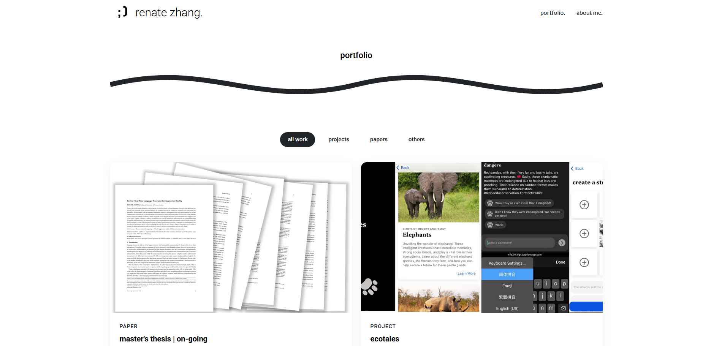

# Portfolio Website - basicasian.github.io

Welcome to my personal portfolio website! This site serves as a way for potential employers and visitors to get a first impression of my work, explore my projects, and access my resume. \
You can visit the live portfolio here: [https://renatezhang.github.io/](https://renatezhang.github.io/)

**Creators:** Renate Zhang  

   

## Features

- **Portfolio** - Showcasing my projects and work.
- **About Me** - A brief introduction about myself.
- **Resume** - Provides access to my resume for potential employers.

## Technologies Used

- **HTML** - Structure of the website
- **CSS** - Styling and layout
- **JavaScript** - Interactive elements and functionality

## Credits

This website is based on the **Active** template by BootstrapMade.

- **Template Name:** Active
- **Template URL:** [https://bootstrapmade.com/active-bootstrap-website-template/](https://bootstrapmade.com/active-bootstrap-website-template/)
- **Author:** BootstrapMade.com
- **License:** [https://bootstrapmade.com/license/](https://bootstrapmade.com/license/)

## License

This project follows the licensing terms of the original template. Any modifications made are for personal use and showcase purposes.

